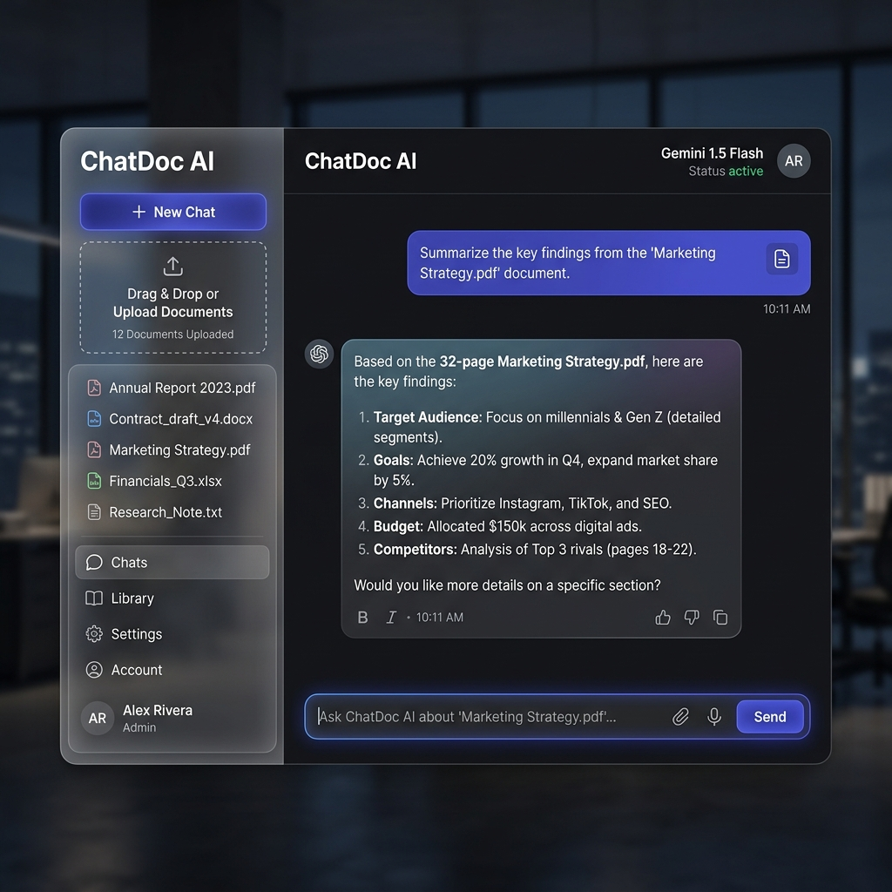

# ChatDoc AI | Intelligent PDF Analysis 🚀

**ChatDoc AI** is a premium, production-ready web application that allows you to interactively chat with your PDF documents. Using Google Gemini 1.5 Flash and a custom FastAPI backend, it provides a fast, secure, and visually stunning experience for document intelligence.



## ✨ Features

-   **Premium UI/UX**: Custom-built with Vanilla HTML/CSS/JS featuring glassmorphism, smooth animations, and a sleek dark mode.
-   **Intelligent Retrieval**: Uses LangChain and FAISS for high-performance semantic search within your documents.
-   **Powered by Gemini**: Leverages Google Gemini 1.5 Flash for state-of-the-art reasoning and concise answers.
-   **Cloud Native**: Fully containerized with Docker and ready for seamless deployment to Google Cloud Run.
-   **FastAPI Backend**: A robust, high-performance API serving both the AI logic and the frontend.

## 🛠️ Tech Stack

-   **Frontend**: HTML5, CSS3 (Glassmorphism), Vanilla JavaScript
-   **Backend**: FastAPI, Python 3.11
-   **AI Framework**: LangChain
-   **LLM & Embeddings**: Google Gemini 1.5 Flash
-   **Vector Database**: FAISS
-   **Deployment**: Docker, Google Cloud Run

## 🚀 Getting Started

### Prerequisites

-   Python 3.11+
-   Google Cloud SDK (`gcloud`)
-   A Google Gemini API Key (get it from [Google AI Studio](https://aistudio.google.com/app/apikey))

### Local Development

1.  Clone the repository and navigate to the project folder:
    ```bash
    git clone <repository-url>
    cd chat-with-pdfs
    ```

2.  Create a virtual environment:
    ```bash
    python3 -m venv venv
    source venv/bin/activate  # On Windows: venv\Scripts\activate
    ```

3.  Install dependencies:
    ```bash
    pip install -r requirements.txt
    ```

4.  Set up environment variables:
    ```bash
    cp .env.example .env
    ```
    Then edit `.env` and add your API keys:
    - Get Google Gemini API Key from [Google AI Studio](https://aistudio.google.com/app/apikey)
    - Or configure Azure OpenAI credentials if using Azure

5.  Run the application:
    ```bash
    python app.py
    ```
    
6.  Visit `http://localhost:8080` in your browser.

## ☁️ Deployment to Google Cloud Run

Deploying to production is simple with the included Dockerfile. Run the following command:

```bash
gcloud run deploy chat-with-pdfs \
  --source . \
  --region us-central1 \
  --allow-unauthenticated \
  --set-env-vars GOOGLE_API_KEY=YOUR_API_KEY
```

## 🔒 Security & Environment Variables

⚠️ **IMPORTANT**: Never commit `.env`, `token.txt`, or any files containing API keys to version control.

- Use `.env.example` as a template for required environment variables
- Create your own `.env` file locally (it's in `.gitignore`)
- Always use environment variables for secrets, never hardcode them
- Never push personal API keys, tokens, or credentials to GitHub

## 📂 Project Structure

-   `app.py` — FastAPI application and API endpoints.
-   `main.py` — Core AI logic (Gemini + LangChain).
-   `static/` — Premium frontend assets (HTML, CSS, JS).
-   `Dockerfile` — Container configuration for production.
-   `requirements.txt` — Production dependencies.

## 📄 License

MIT License
